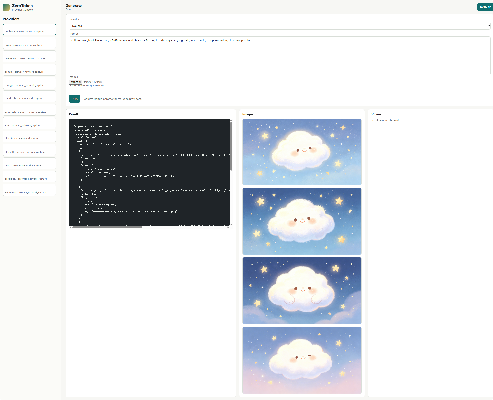
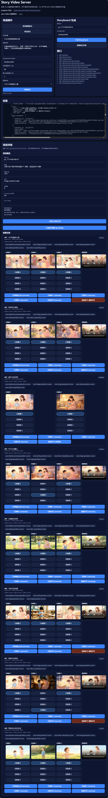

# Zero Video Factory

一个本地化的图文与故事视频生成项目，目标是用尽可能低的接入成本，把“故事文本 -> 分镜 -> 配图 -> 配音 -> 视频”串成一条可执行流水线。

## 这个项目提供什么价值

### 1. 免费图文生成

项目内置 `zero-token` Web Provider Runtime，可以通过浏览器登录态调用网页端模型能力，生成：

- 文本生成结构化 storyboard
- 文生图场景图
- 关键帧扩展图
- 当前生成图片支持无水印输出，且可得到高清结果

### 2. 免费故事视频生成

项目提供一个本地 Story Video Server，将故事文本进一步加工为：

- `storyboard.json`
- scene 图片
- scene 音频
- scene 视频
- final video

### 3. 特点：0 token

这里的 `0 token` 指的是：

- 不依赖官方 API Key 计费调用
- 不走 OpenAI / 各家正式开放平台 token 计费链路
- 主要通过本地浏览器登录态复用网页端能力

更准确地说，这是“0 API token 成本”的工程接入方案，不等于底层模型真的没有 token 消耗。

## 原理说明

项目核心由两部分组成：

### `zero-token` 运行时

`zero-token` 通过 Chrome DevTools Protocol 连接本地已登录的 Chrome / Chromium，会：

- 复用浏览器登录态
- 自动向网页端输入 prompt
- 监听 DOM / 网络返回结果
- 解析网页端返回的文本、JSON、图片结果

因此它不要求你接入官方 API，而是把“人工在网页上操作”变成“本地可编排的自动化调用”。

### 故事视频流水线

故事视频服务采用“弱模型 + 强规则”的方式：

1. 先调用一次模型，把故事转成结构化 `storyboard.json`
2. 再按 scene 拆分任务
3. 生成每个 scene 的图片
4. 生成每个 scene 的 TTS 音频与字幕
5. 用 `ffmpeg` 合成 scene 视频
6. 拼接输出最终视频

也就是说，模型主要负责“理解和规划”，后续媒体生产尽量走确定性工程流程，方便重试、调试和落盘。

## 项目能力

- `Web Demo`：提供图文生成服务，适合调试和验证 `zero-token` 的网页端图文能力
- `story-video`：提供故事视频生成服务，负责从故事文本到最终视频的完整流水线
- 当前图文服务支持：`doubao`、`qwen`
- 当前视频服务支持：`doubao`
- 当前生成图片特征：无水印、高清
- 基于网页登录态的 `zero-token` 图文生成
- 儿童故事转 `storyboard.json`
- scene 级图片生成
- scene 级音频生成
- scene 级视频合成
- final video 拼接
- 项目产物本地落盘，便于排查与复用

## 界面截图

建议把 README 用到的截图统一放在：

```text
docs/screenshots/
```

推荐文件名：

- `text-image-server.png`
- `video-server.png`

当前截图：

### 图文服务

图文服务对应 `Web Demo`，当前主要支持：

- `doubao`
- `qwen`



### 视频服务

视频服务对应 `story-video`，当前仅支持：

- `doubao`



最终结果演示：

[](docs/screenshots/video-demo.mp4)

点击上方封面图可查看演示视频：`video-demo.mp4`

后续如果继续补截图，建议仍然放在 `docs/screenshots/` 下统一管理。

## 使用步骤

### 1. 准备环境

建议准备以下环境：

- Node.js
- npm
- Go
- Chrome 或 Chromium
- `ffmpeg`（用于输出真实 MP4，未安装时会退化为 HTML 预览）
- `edge-tts`（用于本地 TTS）

### Linux 安装方式

以下示例以 Ubuntu / Debian 为主，其他发行版可换成对应包管理器。

#### 1. 安装系统依赖

```bash
sudo apt update
sudo apt install -y curl git ffmpeg python3 python3-pip pipx
```

说明：

- `ffmpeg` 安装后通常会同时带上 `ffprobe`
- `/healthz` 会检查 `ffmpeg` 和 `ffprobe` 是否可用

#### 2. 安装 Node.js

如果系统自带 Node 版本过低，建议安装较新的 LTS：

```bash
curl -fsSL https://deb.nodesource.com/setup_20.x | sudo -E bash -
sudo apt install -y nodejs
```

检查：

```bash
node -v
npm -v
```

#### 3. 安装 Go

如果你机器上的 Go 版本较老，可以直接用包管理器先安装：

```bash
sudo apt install -y golang-go
```

检查：

```bash
go version
```

#### 4. 安装 edge-tts

推荐用 `pipx` 安装，这样可执行文件会直接进入用户路径：

```bash
pipx ensurepath
pipx install edge-tts
```

如果当前 shell 还找不到命令，重新开一个终端，或手动补 PATH：

```bash
export PATH="$HOME/.local/bin:$PATH"
```

检查：

```bash
edge-tts --help
```

#### 5. 安装 Chrome 或 Chromium

可以直接安装 Chromium：

```bash
sudo apt install -y chromium-browser
```

如果你的发行版没有 `chromium-browser`，也可能是：

```bash
sudo apt install -y chromium
```

项目的 `npm run chrome:debug` 会自动尝试查找这些可执行文件。

#### 6. 安装项目依赖并构建

```bash
npm install
npm run build
```

说明：

- `/healthz` 中的 `zero_token_bridge_built` 检查的是 `dist/zero-token/bridge-server.js` 是否已经生成
- 这不是一个额外系统工具，而是执行 `npm run build` 后得到的本地构建产物

#### 7. 启动前自检

先启动故事视频服务：

```bash
npm run dev:story-video
```

再访问：

```text
http://127.0.0.1:4388/healthz
```

正常情况下你会看到类似字段：

- `zero_token_bridge_built`
- `edge_tts`
- `ffmpeg`
- `ffprobe`

只要这些字段都正常，说明 Linux 运行环境基本齐了。

### 2. 安装依赖

```bash
npm install
```

### 3. 启动可复用的 Debug Chrome

```bash
npm run chrome:debug
```

默认会打开本地调试浏览器，并暴露：

```text
http://127.0.0.1:9222
```

然后在该浏览器中手动登录你要使用的网页端模型，例如：

- Doubao
- Qwen
- Gemini
- GLM

### 4. 启动服务

这里有两个不同入口，职责不同：

#### `Web Demo`：图文服务

用于本地测试和调试图文生成能力，主要面向：

- 文本生成结构化结果
- 文生图
- `zero-token` provider 联调

当前支持 Provider：

- `doubao`
- `qwen`

启动命令：

```bash
npm run dev:web
```

默认地址：

```text
http://127.0.0.1:4317
```

#### `story-video`：视频服务

用于故事视频生成，负责：

- 创建项目
- 生成 `storyboard.json`
- 生成 scene 图片
- 生成 scene 音频
- 合成 scene 视频
- 合成 final video

当前支持 Provider：

- `doubao`

启动命令：

```bash
npm run dev:story-video
```

默认地址：

```text
http://127.0.0.1:4388
```

### 5. 典型使用流程

如果你只是想体验图文能力，使用 `Web Demo` 即可。

如果你要跑完整的故事视频生成流程，使用 `story-video` 服务，并按下面顺序调用：

1. 创建项目，填写标题和故事文本
2. 生成 `storyboard`
3. 检查 scene 拆分结果
4. 为每个 scene 生成图片
5. 为每个 scene 生成音频
6. 为每个 scene 合成视频
7. 合成最终视频

推荐调用顺序：

```text
POST /api/projects
POST /api/projects/{projectId}/storyboard
POST /api/projects/{projectId}/scenes/{sceneId}/image
POST /api/projects/{projectId}/scenes/{sceneId}/audio
POST /api/projects/{projectId}/scenes/{sceneId}/video
POST /api/projects/{projectId}/final-video
```

## 目录说明

```text
cmd/story-video-server/    Go 后端，负责项目管理、分镜、音频、视频合成
src/zero-token/           浏览器自动化与网页端 provider 适配层
src/web-demo/             本地调试页面
docs/                     设计方案与补充文档
projects/                 本地产物目录
scripts/                  启动脚本
```

## License 说明

本仓库当前采用自定义非商用许可证，见 [LICENSE](./LICENSE)。

选择它的原因是：

- 允许个人学习、研究、测试和非商用使用
- 和“不得用于商业”这个目标一致

## 免责声明

- 本项目仅供个人学习、技术研究与非商业交流使用。
- 不得将本项目或其生成结果直接或间接用于商业用途。
- 使用者应自行确认其行为符合所在地区法律法规，以及所使用第三方平台的服务条款、使用规范和版权要求。
- 因使用本项目造成的账号风险、平台限制、内容侵权、数据丢失或其他损失，项目作者不承担责任。
- 请勿将本项目用于违法违规、侵权、欺诈、滥用平台资源或其他不当用途。

## 补充说明

- 这不是标准 SaaS API 封装，而是本地浏览器自动化方案。
- `0 token` 不代表完全零成本，只代表不走官方 API token 计费模式。
- 项目当前更适合个人实验、原型验证和工作流探索。
